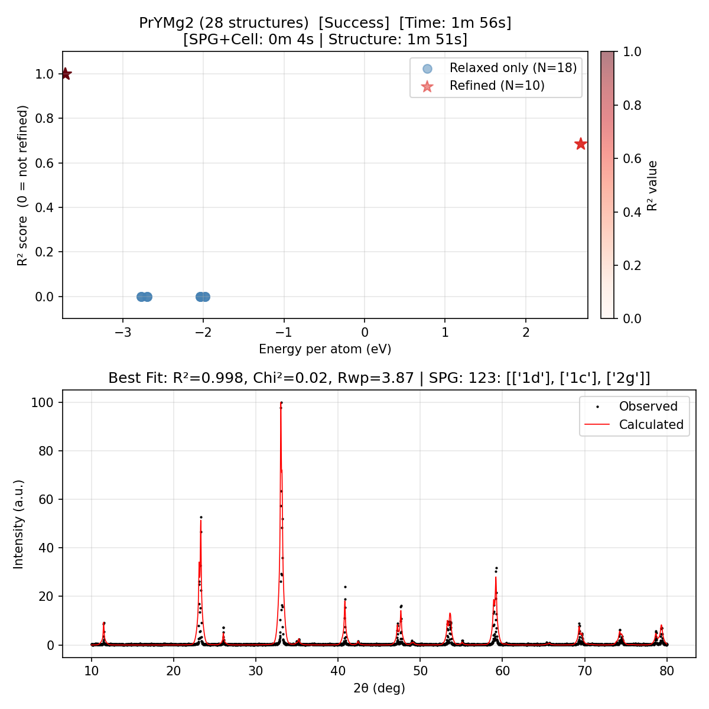
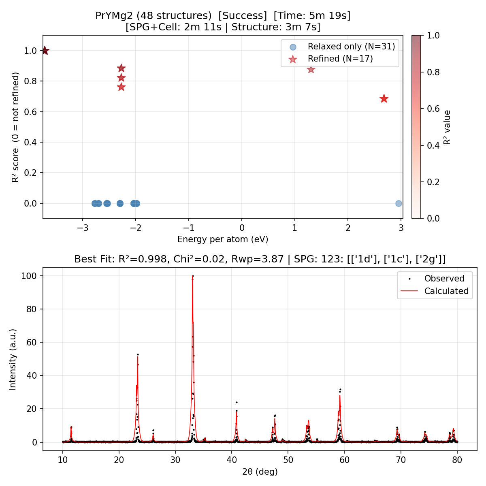

# Ab-PXRD-Solver: Ab Initio Powder X-Ray Diffraction Structure Solver

## Overview

Ab-PXRD-Solver is a fully automated *ab initio* crystal structure determination pipeline. Given an experimental Powder X-Ray Diffraction (PXRD) pattern and a chemical formula, it autonomously:

1. **Preprocesses** the diffraction pattern with adaptive background subtraction, smoothing, and peak detection.
2. **Predicts density bounds** from the chemical formula using a pretrained Roost ensemble model.
3. **Indexes peaks** to candidate unit cells via `CellSolver` (known SPG) or `SmartCellSolver` (unknown SPG).
4. **Enumerates Wyckoff positions** compatible with the composition and density range.
5. **Generates trial structures** using `PyXtal` with Quasi-Random Sampling.
6. **Relaxes structures** with the `MACE` universal neural-network force field via `ASE`.
7. **Screens candidates** by cosine similarity of simulated vs. experimental PXRD patterns.
8. **Refines** promising structures with full-pattern Rietveld refinement via `GSAS-II`.


## Pipeline Flowchart

```
Input: PXRD CSV + formula
          │
          ▼
┌─────────────────────────┐
│   Data Preprocessing    │  adaptive background subtraction → smoothing
│   (RawDataManager)      │  SciPy peaks → ML peak filter
│                         │  Roost density ensemble → density bounds
└────────────┬────────────┘
             │  peaks, density_min/max, formula, composition
             ▼
    ┌────────────────────┐
    │  Space Group Mode? │
    └──┬─────────────────┘
       │
       ├── Known SPG (filename or --spg)
       │        │
       │        ▼
       │   ┌──────────────────────────────────────┐
       │   │  CellSolver                          │
       │   │  hkl enumeration → linear solve →    │
       │   │  mismatch scoring → consolidation    │
       │   └────────────────┬─────────────────────┘
       │                    │
       └── --infer-spg ─────┤
           (model backend)  │
                │           │
                ▼           │
           CNN classifier   │
           top-k SPG list   │
                │           │
                ▼           │
       SmartCellSolver ─────┘
       (smart-cell backend: jointly ranks SPG + cell)
                │
                ▼
┌──────────────────────────────────────────────────────────┐
│  For each (cell, SPG) pair, ordered by estimated cost:   │
│                                                          │
│   WPManager: enumerate valid Wyckoff assignments         │
│   XtalManager: generate trial structures (PyXtal)        │
│       ↓  Quasi-Random Sampling (QRS)                     │
│   MACE force field: geometry relaxation (ASE)            │
│   XRD.py: simulate pattern → Autocorrelation             │
│       ↓  if sim ≥ threshold or (sim + energy gate)       │
│   GSAS-II: Rietveld refinement                           │
│       ↓  if R² ≥ 0.95 or χ² ≤ 0.12                       │
│   ✓ ACCEPTED — save CIF + plot, exit immediately         │
└──────────────────────────────────────────────────────────┘
          │
          ▼
Output: Results/cifs/Match_<formula>_<spg>.cif
        Results/logs/<run>.log
        Results/summary.csv
```


## Module Structure

```
PXRD-Agent/
├── PXRD_solve.py              # Main entry point (deterministic pipeline)
├── pxrd_app/
│   ├── cli.py                 # Argument parsing, batch dispatch, parallel workers
│   ├── constants.py           # DEFAULT_STATE — all tunable hyperparameters
│   ├── core.py                # Pipeline stages: run_data_preprocessor,
│   │                          #   run_cell_solver, run_wyckoff_solver
│   ├── inference.py           # SPG inference backends, SmartCellSolver ranking
│   ├── runtime.py             # Results CSV writing, timing summary
│   └── tools/
│       ├── manager.py         # RawDataManager, CellManager, WPManager, XtalManager
│       │                      #   generate_qrs_grid
│       ├── solver.py          # CellSolver, SmartCellSolver, search_solution,
│       │                      #   enumerate_wyckoff, get_adaptive_wp_limits
│       ├── density.py         # Roost ensemble density predictor
│       ├── peak_prediction.py # CNN peak detector + space group classifier
│       ├── XRD.py             # Pattern simulation, Similarity (cosine) metric
│       ├── gsas.py            # GSAS-II Rietveld refinement wrapper
│       ├── ase_opt.py         # MACE + ASE structure relaxation
│       └── utils.py           # parse_formula, relax_structure, volume helpers
├── Examples/                  # Sample PXRD CSV files
├── GSAS_PXRD/                 # Larger benchmark dataset
├── data/                      # CIF reference files, run lists
└── environment.yml            # Conda environment spec
```


## Stage 1 — Data Preprocessing

**Code:** `pxrd_app/core.py → run_data_preprocessor`  
**Key class:** `pxrd_app/tools/manager.py → RawDataManager`

### 1.1 Filename Parsing

The chemical formula and space group are parsed from the filename convention `PXRD_<formula>_<spg>.csv`:

```
PXRD_PrYMg2_123.csv  →  formula = "PrYMg2",  spg = 123
```

Use `--formula` to override, or `--infer-spg` to ignore the filename SPG entirely. Hyphen-separated names are also supported.

### 1.2 Adaptive Background Subtraction

If `min(intensity) > 2.5`, background subtraction is applied via **asymmetric least-squares polynomial fitting** (order 6, 50 iterations, asymmetry `asym = 0.01`). The corrected pattern is saved as `<name>_bg_subtracted.csv` for downstream use. A **Savitzky-Golay filter** (window 4, polynomial order 3) then smooths noise while preserving peak shapes.

### 1.3 Peak Detection

`RawDataManager.get_peaks_from_scipy()` calls `scipy.signal.find_peaks` with conservative thresholds to over-detect peaks. `filter_peaks_by_ml()` then filters with a pretrained CNN model — a peak is **removed** only when **both** of these hold:

- Model peak probability < 0.8
- Intensity < `min_height` (3.0–7.5, depending on background mode)

### 1.4 Density Prediction

`predict_density_ensemble()` runs a **Roost** message-passing neural network ensemble on the composition. Predictions are aggregated as `mean ± 2.5·std`, yielding `density_min` and `density_max` (g/cm³). The minimum cell volume bound is:

$$V_{\text{min}} = \frac{M_{\text{formula}}}{d_{\text{max}} \cdot N_A} \times 10^{24}  (\text{Å}^3)$$


## Stage 2 — Space Group Inference and Cell Indexing

### 2.1 Space Group Modes

| Mode | Flag | How SPG is obtained |
|------|------|---------------------|
| **Filename** | *(default)* | Parsed from `_<spg>.csv` suffix |
| **Override** | `--spg N` | Fixed to space group N |
| **SmartCellSolver** | `--infer-spg --spg-backend smart-cell` | Jointly enumerates SPGs and cells, ranked by indexing quality |


### 2.2 CellSolver (known SPG)

`CellSolver` in `pxrd_app/tools/solver.py`:

1. **hkl enumeration** — all symmetry-allowed (h k l) triples up to `hkl_max = (2, 5, 6)`.
2. **Linear solve** — Bragg equation + lattice metric form a linear system solved by `numpy.linalg.solve`. For tetragonal:

$$\frac{1}{d^2} = \frac{h^2+k^2}{a^2} + \frac{l^2}{c^2}$$

3. **Mismatch scoring** — peaks re-indexed against trial cell at tolerances `[0.1°, 0.15°, 0.5°]`.

For orthorhombic SPGs, all six axis permutations are tried to handle axis-setting ambiguity.

### 2.3 SmartCellSolver (unknown SPG)

`SmartCellSolver` sweeps through space groups from **highest to lowest symmetry** (cubic → triclinic), simultaneously solving for unit cells under each SPG. Solutions are ranked jointly by mismatch, χ², and volume. This is the recommended mode when the SPG is unknown. The solver stops early once an ideal-mismatch solution is found for a high-symmetry system.

### 2.4 Cell Consolidation

`CellManager.consolidate()` merges equivalent cells (within 5% on each parameter) and retains the top `max_cells = 10` solutions ranked by (missing peaks, χ²).


## Stage 3 — Crystal Structure Solution

**Code:** `pxrd_app/core.py → run_wyckoff_solver`  
**Key function:** `pxrd_app/tools/solver.py → search_solution`

### 3.1 Wyckoff Position Enumeration

`WPManager` lists all valid Wyckoff position assignments where each element's site multiplicities sum to its count in the formula and the resulting density is within `(density_min, density_max)`. Assignments are reranked by `score_wp_candidate()` to prefer smaller-volume, lower-mismatch, lower-DOF, fewer-site configurations.

### 3.2 Trial Structure Generation and Quasi-Random Sampling

`XtalManager` uses **PyXtal** to place atoms on Wyckoff sites with **Quasi-Random Sampling:** Fractional coordinates are drawn from a **Sobol** or **Halton** low-discrepancy sequence (`generate_qrs_grid` in `pxrd_app/tools/manager.py`) instead of pseudo-random numbers. This provides better uniform coverage of coordinate space with fewer trials.

### 3.3 Geometry Relaxation (MACE + ASE)

Each trial structure is relaxed with the **MACE** universal force field via ASE:

1. Coarse relaxation (`10 × DOF` steps).
2. Stress check — structures with diagonal stress > 5 GPa are discarded.
3. Fine relaxation (`5 × DOF` steps, `fmax = 0.1` eV Å⁻¹).

Only structures with `max_force ≤ 0.5` eV Å⁻¹ and `max_stress ≤ 0.3` GPa pass to screening. The global minimum energy per atom `eng_best` is tracked across all valid structures.

### 3.4 Pattern Similarity Screening

A theoretical PXRD pattern is simulated (2θ: 10°–80°, step 0.02°, Cu-Kα₁ λ = 1.54184 Å) and compared to the experiment using a cosine-like `Similarity` metric. A structure proceeds to refinement when **either** condition holds:

| Trigger | Condition |
|---------|-----------|
| Similarity gate | `sim ≥ sim_max − 0.02` (default: `sim ≥ 0.88`) |
| Energy + similarity gate | `sim ≥ 0.70` **and** `eng − eng_best ≤ max_eng_rel` |

`sim_max` (default 0.9) is automatically lowered for light-element compositions (Z ≤ 6) or sparse peak sets (≤ 4 peaks).

### 3.5 Rietveld Refinement (GSAS-II)

`pxrd_app/tools/gsas.py` wraps GSAS-II for full-pattern Rietveld refinement. A per-refinement wall-time limit of 60 s prevents hangs; GSAS-II is recycled every 30 calls to avoid memory leaks.

A solution is **accepted** when:

$$R^2 \geq 0.95 \quad \text{and} \quad \chi^2 \leq 0.12$$

The pipeline exits immediately on the first accepted solution.

### 3.6 Key Search Parameters

| Parameter | Default | Meaning |
|-----------|---------|---------|
| `max_wp` | 18 | Max Wyckoff sites per assignment |
| `max_dof` | 25 | Max degrees of freedom per WP combination |
| `max_Z` | 24 | Max formula units per cell |
| `max_eng_rel` | 0.1 eV/atom | Energy window above best for refinement|
| `max_force` | 0.5 eV/Å | Max per-atom force after relaxation |
| `max_stress` | 0.3 GPa | Max diagonal stress after relaxation |
| `min_r2` | 0.95 | Rietveld acceptance: R² |
| `max_chi2` | 0.12 | Rietveld acceptance: χ² |
| `gsas_refine_timeout` | 60 s | Per-refinement wall-time limit |

---

## Machine Learning Models

| Model | Location | Task |
|-------|----------|------|
| Peak detector | `pxrd_app/tools/peak_finder/` | Assign peak probability to each 2θ point (CNN/transformer) |
| Space group predictor | `pxrd_app/tools/spacegroup/` | Rank space groups from PXRD profile + formula |
| Density ensemble | `pxrd_app/tools/aviary/` | Predict density mean + uncertainty from composition (Roost) |

---


## Environment Setup & Installation

```bash
conda env create -f environment.yml
conda activate ab-pxrd-solver
```

## Usage

### Quick Start

```bash
# Single file, SPG from filename
python PXRD_solve.py --input Examples/PXRD_PrYMg2_123.csv
```
This run will generate a list of trial solutions as follows.
```
Pair  SPG   Cell                             #WPs Volume(ų)    Chi2     N_m     N_t    Priority Score
--------------------------------------------------------------------------------------------------------
1     123   [ 3.818   7.701                ] 12     112.2      0.0004     7      42     0.035
2     123   [ 5.399  15.401                ] 2      448.9      0.0003    26      30     0.104
3     123   [ 5.399   7.701                ] 7      224.5      0.0004    22      91     0.123
4     123   [ 7.635   7.701                ] 2      448.9      0.0004    25      42     0.126
5     123   [ 3.818  30.832                ] 2      449.4      0.0030    11      18     0.131
6     123   [ 3.818  15.401                ] 7      224.5      0.0004    13     195     0.141
7     123   [ 7.652   3.843                ] 7      225.0      0.0392    17      39     0.466
8     123   [10.821   3.843                ] 2      449.9      0.0312    19      60     0.786
```
The solver goes through the list and finds an excellent fit for the first cell which is the energy minimum with a high R2 value, and then stops the search.

<figure>
  
  <figcaption>Figure 1. Solution when SPG is known.</figcaption>
</figure>

```bash
# Single file, infer SPG with SmartCellSolver 
python PXRD_solve.py --input Examples/PXRD_PrYMg2_123.csv --infer-spg

Pair  SPG   Cell                             #WPs Volume(ų)    Chi2     N_m     N_t    Priority Score
--------------------------------------------------------------------------------------------------------
1     115   [ 3.818   7.701                ] 3      112.2      0.0004     7      21     0.034
2     123   [ 3.818   7.701                ] 12     112.2      0.0004     7      42     0.048
3     99    [ 3.818   7.701                ] 2      112.2      0.0004     7      49     0.052
4     127   [ 5.399   7.701                ] 2      224.5      0.0004    22      10     0.056
5     140   [ 5.399  15.401                ] 6      448.9      0.0004     6      30     0.076
6     82    [ 5.399  15.401                ] 1      448.9      0.0003     9      25     0.079
7     111   [ 5.399   7.701                ] 2      224.5      0.0004    22      24     0.087
8     69    [ 7.634  15.401   7.639        ] 1      898.2      0.0005     6      29     0.124
9     69    [15.401   7.634   7.639        ] 1      898.2      0.0005     6      29     0.124
10    69    [ 7.634   7.639  15.401        ] 1      898.2      0.0005     6      29     0.124
11    100   [ 5.399   7.701                ] 2      224.5      0.0004    22      52     0.128
12    131   [ 3.818  15.414                ] 6      224.7      0.0044    13      12     0.130
13    108   [ 5.399  15.401                ] 2      448.9      0.0004     6     100     0.138
14    139   [ 5.399  15.401                ] 3      448.9      0.0003     9      90     0.150
15    129   [ 5.399   7.701                ] 5      224.5      0.0004    22      91     0.169
16    123   [ 5.399   7.701                ] 7      224.5      0.0004    22      91     0.169
17    123   [ 7.635   7.701                ] 2      448.9      0.0004    25      42     0.172
...
69    127   [10.821   3.850                ] 2      450.8      0.0407    15      80     1.236
70    82    [ 5.399  30.832                ] 3      898.8      0.0037    11     460     1.394
71    82    [10.811   7.692                ] 3      899.1      0.0167    11     284     1.995
```
When the space group is unknown, the solver will generate a larger list and then goes through the list. It takes a longer time to find the excellent fit  which is the energy minimum with a high R2 value.

<figure>
  
  <figcaption>Figure 2. Solution when SPG is unknown.</figcaption>
</figure>

```bash
# Batch: file list (SLURM-style array job)
python PXRD_solve.py --use-list --input data/test.txt --infer-spg --workers 48 
```

### All CLI Arguments

| Argument | Default | Description |
|----------|---------|-------------|
| `--input PATH` | `Examples/PXRD_PrYMg2_123.csv` | CSV file, directory of CSVs, or (with `--use-list`) a text file of paths |
| `--use-list` | off | Treat `--input` as a text file with one CSV path per line |
| `--output DIR` | `Results` | Output directory for CIFs, logs, plots, and summary CSV |
| `--formula STR` | *(from filename)* | Override formula instead of parsing from filename |
| `--spg N` | *(from filename)* | Fix or filter to a single space group (1–230) |
| `--infer-spg` | off | Infer space group from data instead of reading from filename |
| `--max-vol V` | 1500.0 | Maximum allowed unit-cell volume (ų) |
| `--max-wp N` | 18 | Max Wyckoff sites per assignment |
| `--max-dof N` | 25 | Max degrees of freedom per WP combination |
| `--max-z N` | 24 | Max Z (formula units per cell) |
| `--max-sim S` | 0.9 | Similarity threshold for refinement trigger 1 |
| `--max-eng E` | 0.1 | Energy-above-best (eV/atom) threshold for refinement trigger 2 |
| `--qrs` | `halton` | QRS sampler type (`sobol` or `halton`) |
| `--workers N` | 1 | Parallel CSV workers (batch mode) |
| `--list-wp-only` | off | List Wyckoff candidates only, skip structure generation |
| `--ase-log PATH` | *(none)* | Write ASE FIRE optimizer logs to this file |
| `--wp-path PATH` | `pxrd_app/tools/spg_comp_wp.csv` | Precomputed WP count table for cost estimation |

### Environment Variables

| Variable | Default | Description |
|----------|---------|-------------|
| `PXRD_SUPPRESS_TORCH_LOAD_FUTUREWARNING` | `1` | Suppress PyTorch FutureWarning on checkpoint load |

---

## Input / Output

### Input Format

A two-column CSV file:

```
2theta,intensity
10.02,12.3
10.04,14.1
...
```

**Filename convention:** `PXRD_<formula>_<spg>.csv` (e.g., `PXRD_PrYMg2_123.csv`). The SPG suffix is used when `--infer-spg` is not set. The formula is always parsed from the filename unless `--formula` overrides it.

### Output

All results are written to `--output` (default: `Results/`):

| Path | Description |
|------|-------------|
| `cifs/Match_<formula>_<spg>.cif` | Best refined crystal structure (CIF) |
| `logs/<name>.log` | Per-system run log with full diagnostics |

`tmp/` (GSAS-II intermediates) is created under the output directory and can be deleted after a run.


## Citation and online database
```
@misc{su2026abinitiocrystalstructuredetermination,
      title={Ab-initio Crystal Structure Determination from Powder X-Ray Diffraction}, 
      author={Kaixiang Su and Osman Goni Ridwan and Hongfei Xue and Qiang Zhu},
      year={2026},
      eprint={2605.24594},
      archivePrefix={arXiv},
      primaryClass={cond-mat.mtrl-sci},
      url={https://arxiv.org/abs/2605.24594}, 
}
```
The systematic results on 1000+ systems is available via https://mmi.charlotte.edu/ab_pxrd_solver
